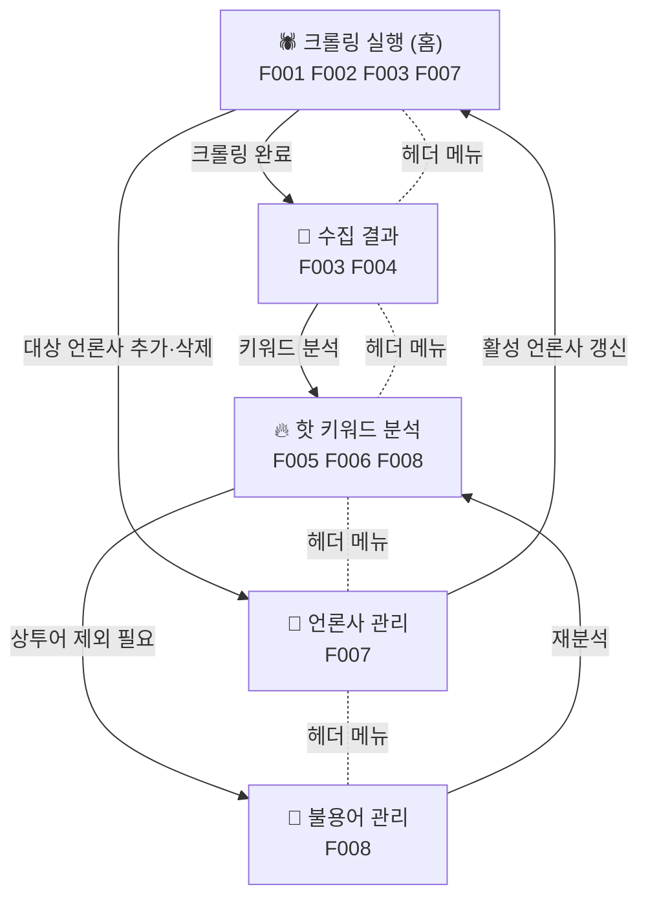

# 화면 설계서 (Screen Specs)

`docs/PRD.md`에서 확정된 5개 페이지의 화면 설계 문서 모음입니다.
각 문서는 **정적 마크업과 레이아웃**만 다룹니다. 비즈니스 로직·상태 관리·데이터 페칭은 범위 밖입니다.

---

## 📑 문서 목록

| 문서 | 화면 | 구현 기능 ID | 역할 |
|------|------|-------------|------|
| [00-app-shell.md](./00-app-shell.md) | 공통 앱 셸 | — | 모든 페이지가 공유하는 헤더·내비게이션·컨테이너·토스트 |
| [01-crawl-run.md](./01-crawl-run.md) | 크롤링 실행 페이지 (홈) | F001, F002, F003, F007 | 언론사 체크박스 선택 → 크롤링 시작 → 진행 상태 |
| [02-collect-result.md](./02-collect-result.md) | 수집 결과 페이지 | F003, F004 | 실행(run) 목록 → 기사 txt 목록 → 본문 미리보기 |
| [03-hot-keyword.md](./03-hot-keyword.md) | 핫 키워드 분석 페이지 | F005, F006, F008 | 형태소 분석 → 키워드 빈도 랭킹 |
| [04-press-manage.md](./04-press-manage.md) | 언론사 관리 페이지 | F007 | 언론사 추가/수정/삭제/활성 전환 |
| [05-stopword-manage.md](./05-stopword-manage.md) | 불용어 관리 페이지 | F008 | 불용어 추가/삭제 |

---

## 🧭 라우트 매핑 (확정)

구현된 `components/layout/nav-items.ts`의 `NAV_ITEMS`가 기준입니다. 모든 화면 문서의 링크는 이 표를 따릅니다.

| 화면 | 라우트 | 파일 | 메뉴 아이콘(lucide) |
|------|--------|------|--------------------|
| 크롤링 실행 (홈) | `/` | `app/page.tsx` | `Bug` |
| 수집 결과 | `/results` | `app/results/page.tsx` | `FileText` |
| 핫 키워드 분석 | `/keywords` | `app/keywords/page.tsx` | `Flame` |
| 언론사 관리 | `/press` | `app/press/page.tsx` | `Newspaper` |
| 불용어 관리 | `/stopwords` | `app/stopwords/page.tsx` | `Ban` |

### 화면별 컴포넌트 디렉터리 · 클라이언트 래퍼 (확정)

각 화면의 본문 조각은 `components/<domain>/`에, 그 화면이 호출하는 fetch 래퍼는 `lib/api/*-client.ts`에 둡니다.
경로는 `docs/ROADMAP.md`의 화면 Task「생성/수정 파일」에서 그대로 가져온 것이며, 화면 문서의 마크업 스켈레톤은 이 파일명을 그대로 씁니다.

| 화면 | 구현 Task | 컴포넌트 디렉터리 | 이 화면이 만드는 컴포넌트 | 클라이언트 래퍼 |
|------|-----------|------------------|--------------------------|----------------|
| 01 크롤링 실행 (홈) | Task 016 | `components/crawl/` | `press-select-card.tsx` `crawl-run-panel.tsx` `press-run-status-list.tsx` | `lib/api/crawl-client.ts` |
| 02 수집 결과 | Task 018 | `components/results/` | `run-select.tsx` `run-summary-card.tsx` `article-file-list.tsx` `article-preview.tsx` | `lib/api/run-client.ts` |
| 03 핫 키워드 분석 | Task 022 | `components/keywords/` | `analysis-filter-bar.tsx` `analysis-summary.tsx` `top-keyword-cards.tsx` `keyword-rank-table.tsx` `keyword-rank-card-list.tsx` `analysis-progress.tsx` | `lib/api/keyword-client.ts` |
| 04 언론사 관리 | Task 009 · 010 | `components/press/` | `press-table.tsx` `press-card-list.tsx` `press-form-dialog.tsx` `source-type-badge.tsx` `delete-press-dialog.tsx` `source-test-panel.tsx` | `lib/api/press-client.ts` |
| 05 불용어 관리 | Task 012 | `components/stopwords/` | `stopword-chip.tsx` `stopword-add-card.tsx` `stopword-section.tsx` | `lib/api/stopword-client.ts` |

- 파일명은 kebab-case, 컴포넌트 이름은 PascalCase입니다(`press-form-dialog.tsx` → `PressFormDialog`).
- 두 화면 이상이 함께 쓰는 조각은 `components/common/`으로 올립니다. 단 `source-type-badge.tsx`는 예외로 `components/press/`에 두고 01이 import합니다(도메인이 언론사이기 때문).

## 📦 화면별 사용 shadcn 컴포넌트 (6개 문서 합집합)

**설치는 이미 끝났습니다.** Task 002에서 아래 13종을 한 번에 설치했고, `components/ui/`에 실물이 있습니다. 화면 Task는 추가 설치 없이 import만 하면 됩니다.

```bash
# 실행 완료 — 재실행 불필요
npx shadcn@latest add alert-dialog checkbox dialog empty label progress scroll-area select separator sheet switch textarea toggle-group
```

기존 설치분: `alert` `badge` `breadcrumb` `button` `card` `input` `navigation-menu` `skeleton` `sonner` `table`
(`toggle`은 `toggle-group`의 의존성으로 함께 설치됐습니다.)

새 컴포넌트가 더 필요해지면 **직접 설치하지 말고 보고합니다** — `package.json` 동시 편집 충돌을 막기 위해 회차 단위로 팀장이 일괄 처리합니다(`docs/CONVENTIONS.md` §8).

| 컴포넌트 | 쓰는 화면 |
|----------|------------|
| `sheet` `empty` | 00 앱 셸 (모바일 메뉴 / 공통 빈 상태) |
| `checkbox` `progress` `separator` `scroll-area` `label` | 01 크롤링 실행 |
| `select` `scroll-area` `separator` `label` | 02 수집 결과 |
| `select` `toggle-group` `label` | 03 핫 키워드 분석 (`progress`는 쓰지 않는다 — 부정형 표시를 `aria-hidden` 장식 트랙으로 그린다. 사유는 `03-hot-keyword.md`) |
| `dialog` `alert-dialog` `switch` `label` `textarea` | 04 언론사 관리 |
| `alert-dialog` `label` `textarea` | 05 불용어 관리 |

> 차트 라이브러리(recharts 기반 `chart`)는 도입하지 않습니다. 03의 빈도 막대는 Tailwind만으로 그립니다 — 근거는 `03-hot-keyword.md` 참고.

---

## 🗺️ 화면 전환 흐름



- **실선** = 화면 안의 버튼/링크로 이어지는 주 동선
- **점선** = 상단 헤더 메뉴로 언제든 이동 가능한 경로 (5개 페이지 모두 상호 이동 가능)

---

## 🎨 공통 디자인 스펙

모든 화면 문서는 아래 규칙을 공통으로 따릅니다.

### 공통 컴포넌트 사용 규칙 (가장 먼저 읽을 것)

페이지 골격은 **이미 구현된 공통 컴포넌트를 호출**합니다. 같은 마크업을 화면마다 다시 그리지 않습니다.
아래 4개는 Task 002에서 `components/common/`에 실물로 만들어졌고, `01~05` 문서의 마크업 스켈레톤도 **이 컴포넌트를 호출하는 형태**로 씁니다.

| 역할 | 호출할 컴포넌트 | 파일 |
|------|----------------|------|
| 본문 컨테이너(`<main>` + 컨테이너 `<div>`) | `<PageContainer>` | `components/common/page-container.tsx` |
| 페이지 헤더(Breadcrumb + h1 + 설명 + 액션) | `<PageHeader>` | `components/common/page-header.tsx` |
| 빈 상태 | `<EmptyState>` | `components/common/empty-state.tsx` |
| 오류 | `<ErrorAlert>` | `components/common/error-alert.tsx` |
| 카테고리 다중 선택 필터(21일차, Task 028) | `<CategoryFilter>` | `components/common/category-filter.tsx` |

**⑤ `<CategoryFilter>`** — `04`(언론사 목록 필터) · `02`(기사 목록 필터) · `03`(분석 필터)이 함께
쓰는 카테고리(IT/AI·엔터·스포츠·경제·증권) 다중 선택 `ToggleGroup`이다. 라벨은 항상
`PRESS_CATEGORY_LABELS`(`lib/types/press.ts`, 저장소 계층 소유)에서 가져오고 화면에서 직접
타이핑하지 않는다. `value`가 빈 배열이면 "전체"라는 뜻이며, 각 API의 `category` 반복 쿼리
파라미터(미지정 = 전체)와 규칙이 같다.

```ts
// components/common/category-filter.tsx
export interface CategoryFilterProps {
  id?: string
  value: PressCategory[]
  onValueChange: (value: PressCategory[]) => void
  disabled?: boolean
  'aria-label': string
}
```

**① `<PageContainer>`** — `<main className="flex-1">`와 `container mx-auto max-w-6xl px-4 py-6 md:py-8`를 이 컴포넌트가 함께 제공합니다.
**화면 문서 스켈레톤에서 같은 클래스를 직접 쓴 `<div>`를 그리지 않습니다.** 직접 그리면 `<main className="flex-1">`가 빠지기 쉽고,
`app/layout.tsx`의 `<body className="flex min-h-full flex-col">` 아래에서 `flex-1`이 없으면 본문이 세로 공간을 못 잡아 셸이 깨집니다.
폭은 `width` prop으로만 조정하고 `max-w-*`를 덧붙이지 않습니다.

```ts
// components/common/page-container.tsx
export interface PageContainerProps {
  children: React.ReactNode
  /** 'default' = max-w-6xl · 'wide' = max-w-7xl(넓은 표) · 'narrow' = max-w-3xl(폼·칩 목록) */
  width?: 'default' | 'wide' | 'narrow'
  className?: string
}
```

**② `<PageHeader>`** — 제목·설명·브레드크럼·우측 액션을 캡슐화합니다. 브레드크럼 링크는 컴포넌트 안에서 이미
`<BreadcrumbLink asChild><Link href=…>`로 감싸져 있으므로, **호출 쪽에서 raw `<BreadcrumbLink href>`를 쓰지 않습니다.**
`href`가 없는 항목은 자동으로 `BreadcrumbPage`(현재 페이지)로 렌더됩니다. 브레드크럼 단계 규칙은 [`00-app-shell.md`](./00-app-shell.md) 참고.

```ts
export interface PageHeaderCrumb { label: string; href?: string }
export interface PageHeaderProps {
  breadcrumbs: PageHeaderCrumb[]
  title: string
  description?: string
  action?: React.ReactNode
}
```

**③ `<EmptyState>`** — `01~05` 공용입니다. 화면마다 다른 빈 상태 구조를 만들지 않고 아이콘·문구·액션만 바꿉니다.
액션이 **페이지 이동이면 `actionHref`**(내부에서 `<Button asChild><Link>`로 렌더), 그 자리에서 처리할 동작이면 `onAction`을 줍니다.

```ts
// components/common/empty-state.tsx
export interface EmptyStateProps {
  icon: React.ReactNode
  title: string
  description: string
  actionLabel?: string
  /** 액션이 페이지 이동이면 href를, 그 자리에서 처리할 동작이면 onAction을 준다. */
  actionHref?: string
  onAction?: () => void
}
```

**④ `<ErrorAlert>`** — `Alert variant="destructive"` 래퍼. `role="alert"`은 `components/ui/alert.tsx`에 내장돼 있어 따로 주지 않습니다.

```ts
// components/common/error-alert.tsx
export interface ErrorAlertProps {
  title?: string // 기본값 '오류가 발생했어요'
  description: string
  onRetry?: () => void // 주면 [다시 시도] 버튼이 붙는다
}
```

**⑤ 내부 이동은 `next/link`** — `app/` 하위에서 raw `<a href="/...">`를 쓰면 `@next/next/no-html-link-for-pages`가
**error**로 걸려 `npm run lint`가 실패합니다(실측 확인). shadcn `Button`·`BreadcrumbLink`는 `asChild`로 `<Link>`를 감쌉니다.

```tsx
<Button asChild>
  <Link href="/">크롤링 실행하러 가기</Link>
</Button>
```

### lucide 아이콘 별칭 (신 별칭으로 통일)

같은 아이콘에 구/신 두 별칭이 있어 문서마다 표기가 갈렸습니다. 빌드는 어느 쪽이든 통과하지만 교차검증 때마다 다시 논쟁이 되므로
**신 별칭 하나로 고정**합니다. 구현된 `components/common/error-alert.tsx`도 `TriangleAlert`를 씁니다.

| 구 별칭 (쓰지 않음) | **신 별칭 (사용)** | 주 용도 |
|--------------------|-------------------|---------|
| `Loader2` | **`LoaderCircle`** | 로딩 스피너 |
| `CheckCircle2` | **`CircleCheckBig`** | 성공·완료 |
| `XCircle` | **`CircleX`** | 실패 |
| `AlertTriangle` | **`TriangleAlert`** | 경고·오류 Alert |

메뉴 아이콘(`Bug` `FileText` `Flame` `Newspaper` `Ban`)처럼 별칭이 하나뿐인 것은 그대로 씁니다.

### 1. 디자인 토큰

`app/globals.css`에 정의된 CSS 변수를 Tailwind v4 유틸리티로 사용합니다. **하드코딩 색상(`bg-zinc-50`, `text-gray-600` 등) 금지** — 라이트/다크 모드가 자동으로 따라오지 않습니다.

| 용도 | 클래스 | 비고 |
|------|--------|------|
| 페이지 배경 / 기본 텍스트 | `bg-background` / `text-foreground` | `<body>`에 이미 적용됨 |
| 카드 표면 | `bg-card` / `text-card-foreground` | |
| 보조 텍스트 | `text-muted-foreground` | 설명문, 캡션, 빈 상태 안내 |
| 흐린 배경 | `bg-muted` | 테이블 헤더, 코드 블록 |
| 강조 액션 | `bg-primary` / `text-primary-foreground` | 주 버튼 1개만 |
| 위험 액션 | `text-destructive` / `bg-destructive` | 삭제 |
| 경계선 | `border-border` | |
| 포커스 링 | `ring-ring` | `@layer base`에서 `outline-ring/50` 기본 적용 |
| 라운드 | `rounded-md` / `rounded-lg` | `--radius: 0.625rem` 기준 |

폰트: `app/layout.tsx`가 `next/font/google`로 두 변수를 `<html>`에 붙이고, `app/globals.css`의 `@theme inline`이
`--font-sans: var(--font-geist-sans)` / `--font-mono: var(--font-geist-mono)` / `--font-heading: var(--font-sans)`로 연결합니다.
본문은 `@layer base`의 `html { @apply font-sans }`로 이미 적용되므로 페이지에서 다시 지정하지 않고, 고정폭이 필요한 곳(URL·셀렉터·파일명)만 `font-mono`를 붙입니다.

### 2. shadcn/ui 설정 (프로젝트 실제 값)

| 항목 | 값 |
|------|-----|
| style | **`radix-nova`** (※ new-york 아님) |
| baseColor | `neutral` |
| cssVariables | `true` |
| iconLibrary | `lucide` |
| alias | `@/components/ui`, `@/components`, `@/lib`, `@/hooks` |
| rsc | `true` (기본 서버 컴포넌트, 인터랙션 필요 시 `'use client'`) |

**설치된 컴포넌트** — 6개 문서가 쓰는 것은 전부 설치가 끝나 추가 설치 없이 사용 가능
`alert` `alert-dialog` `badge` `breadcrumb` `button` `card` `checkbox` `dialog` `empty` `input` `label` `navigation-menu`
`progress` `scroll-area` `select` `separator` `sheet` `skeleton` `sonner` `switch` `table` `textarea` `toggle` `toggle-group`

각 화면 문서의 "사용 컴포넌트" 절은 **그 화면이 실제로 import하는 것만** 나열합니다. 설치 명령을 다시 적지 않습니다.
목록에 없는 컴포넌트가 필요해지면 직접 설치하지 말고 보고합니다(위 §화면별 사용 shadcn 컴포넌트 참고).

### 3. 레이아웃 규격

```
┌─ header  h-14, sticky top-0, border-b, bg-background/95 backdrop-blur ─┐  ← <SiteHeader />
├─ main    flex-1                                                        │  ┐
│    └─ div.container.mx-auto.max-w-6xl.px-4.py-6 md:py-8                │  ┘ <PageContainer>가 제공
│         ├─ 페이지 헤더 (Breadcrumb + h1 + 설명)   mb-6                  │  ← <PageHeader />
│         └─ 페이지 본문                            space-y-6            │  ← 화면별 컴포넌트
└─ Toaster (sonner) — 화면 우하단 고정                                   │
```

이 표는 **결과 DOM**입니다. 화면 문서는 `<main>`과 컨테이너 `<div>`를 직접 쓰지 않고 `<PageContainer>`를 호출합니다(위 §공통 컴포넌트 사용 규칙).

- 컨테이너 최대 폭: `max-w-6xl`(`<PageContainer>` 기본값). 표가 넓은 화면은 `width="wide"`(`max-w-7xl`), 폼·칩 목록만 있는 화면은 `width="narrow"`(`max-w-3xl`) — 어느 쪽이든 문서에 사유 명시
- 섹션 간격: `space-y-6`, 카드 내부 요소 간격: `space-y-4`
- 페이지 제목: `text-2xl font-semibold tracking-tight md:text-3xl`
- 페이지 설명: `text-sm text-muted-foreground mt-1`

### 4. 반응형 브레이크포인트

모바일 우선. 각 화면 문서는 **데스크톱(≥1024px)** 과 **모바일(<640px)** 두 벌의 와이어프레임을 반드시 포함합니다.

| 브레이크포인트 | 폭 | 적용 규칙 |
|---------------|-----|----------|
| 기본 (모바일) | ~639px | 1컬럼, 헤더 메뉴는 햄버거로 접힘, 표는 카드 리스트로 대체하거나 `overflow-x-auto` |
| `sm:` | ≥640px | 버튼 가로 배치, 2컬럼 그리드 시작 |
| `md:` | ≥768px | 헤더 메뉴 펼침, 여백 확대 (`py-8`) |
| `lg:` | ≥1024px | 좌우 2단 레이아웃(목록 + 상세) 적용 |

### 5. 와이어프레임 표기 규칙

ASCII 박스 드로잉을 **코드펜스 안에** 작성합니다(고정폭 정렬 유지).

| 기호 | 의미 | | 기호 | 의미 |
|------|------|---|------|------|
| `[ ]` / `[x]` | 체크박스 (해제/선택) | | `( )` / `(o)` | 라디오 |
| `[ 버튼 ]` | 일반 버튼 | | `[[ 주 버튼 ]]` | Primary 버튼 |
| `▼` | 셀렉트/드롭다운 | | `▸` `▾` | 접힘/펼침 |
| `▓▓▓░░░` | 진행률 바 | | `▒▒▒▒` | Skeleton 로딩 |
| `┌─┐ │ └─┘` | 카드·컨테이너 경계 | | `├─┤` | 구분선 |
| `…` | 내용 생략 | | `🔍` `🗑` `✎` | 아이콘 자리 (lucide 이름을 표 아래 명시) |

### 6. 각 화면 문서의 필수 목차

```markdown
# NN. [화면 이름]

## 개요            — 역할 1~2줄, 구현 기능 ID, 진입 경로, 다음 이동
## 화면 구성        — 영역 번호(①②③)와 각 영역의 목적
## 와이어프레임 — 데스크톱 (≥1024px)
## 와이어프레임 — 모바일 (<640px)
## 영역별 컴포넌트 명세  — 영역 / UI 컴포넌트 / Tailwind 클래스 / 비고 표
## 상태별 화면       — 기본 / 로딩 / 빈 상태 / 에러 (해당하는 것만, 각각 와이어프레임)
## 사용 컴포넌트     — 이 화면이 import하는 shadcn 컴포넌트 + lucide 아이콘 목록(설치 명령은 적지 않음)
## 접근성           — 레이블 연결, 키보드 이동, ARIA, 라이브 리전
## 마크업 스켈레톤    — 정적 TSX (로직 없음, 핸들러는 빈 함수 + 한국어 TODO)
```

### 7. 코드 작성 규칙

- **정적 마크업만.** `useState`/`useEffect`/`fetch`/서버 액션/검증 로직 금지.
- **골격은 공통 컴포넌트를 호출**합니다(`<PageContainer>` `<PageHeader>` `<EmptyState>` `<ErrorAlert>`). 같은 마크업을 다시 그리지 않습니다.
- 인터랙션 지점은 `onClick={() => {}}` 플레이스홀더 + `{/* TODO: ~ 구현 필요 */}` 한국어 주석.
- 주석은 한국어, 변수·함수명은 영어.
- props는 TypeScript `interface`로 타입만 정의.
- 반복 목록은 하드코딩 더미 배열로 형태만 보여줍니다(`const MOCK_PRESS = [...]`).
- 접근성: `<label htmlFor>` 연결, 아이콘 전용 버튼은 `aria-label`, 진행 상태는 `role="status" aria-live="polite"`, 표는 `<caption>` 또는 `aria-label`.

---

## 📌 참고

- 요구사항 원본: [`docs/PRD.md`](../PRD.md)
- 코드 규약(디렉터리·명명·구현 방식)의 단일 소스: [`docs/CONVENTIONS.md`](../CONVENTIONS.md)
- 구현 범위와 Task별 생성 파일: [`docs/ROADMAP.md`](../ROADMAP.md)
- 기존 크롤러 골격: `lib/crawler/` (Playwright + cheerio + p-limit + zod)
- 설치된 UI 컴포넌트: `components/ui/`
- 호출할 공통 컴포넌트: `components/common/`, 앱 셸: `components/layout/`
- 디자인 토큰 정의: `app/globals.css`
